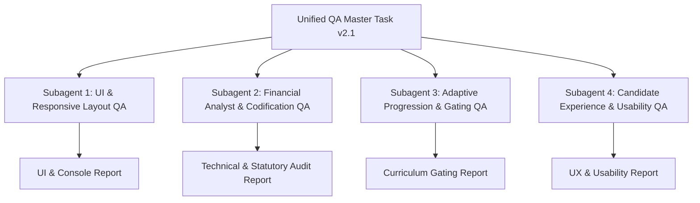

# Unified QA Testing Master Specification — CPA Interactive Study Guide Platform

**Target Environment:** `https://demo.i-te.am/cpa/` (Fallback: `http://localhost:8005/`)  
**Runtime Engine:** Browserless Chrome over CDP (Headless Chrome Automation)  
**Document Version:** 2.1 (DevSecOps Hardened Edition)  
**Last Updated:** 2026-07-24  

---

## 🎯 Executive Overview & Subagent Task Partitioning

This master document unifies all Quality Assurance (QA), financial accuracy, responsive layout, progression gating, security auditing, and candidate experience testing for the **CPA Interactive Study Guide** platform. 

To maximize test efficiency and prevent database state bleed, testing is partitioned into **four specialized subagent roles**. 

> [!NOTE]
> **Subagent Concurrency**: Subagents execute **concurrently**, not sequentially. No subagent depends on another's runtime output.



---

## 📋 Execution Prerequisites

Prior to dispatching subagents, verify the following infrastructure prerequisites:
1. **Browserless Chrome Service**: Headless Chrome over CDP container must be active and listening.
2. **Target Accessibility**: Confirm `curl -I https://demo.i-te.am/cpa/` returns HTTP 200 OK.
3. **Database Snapshot**: Ensure a database backup (`cpa_prep.db` or Postgres snapshot) is available before executing destructive reset tests.
4. **Network Egress**: Subagents require outbound HTTP/HTTPS connectivity to verify external exhibit links (FASB ASC, Becker, Federal Reserve, COSO).

---

## 🔑 Global Subagent Authentication & Hardened Identity Protocol

> [!IMPORTANT]
> **Mandatory Unique Registration Format**:
> Each subagent **MUST** register a distinct email address using an unambiguous **ISO 8601 UTC timestamp format without separators**: `YYYYMMDDTHHmmZ` (e.g. `20260724T1459Z`). If two subagents spawn within the same minute, append a single random digit (e.g., `qa_ui_20260724T1459Z1@cpa-qa.com`).

| Subagent Role | Required Email Format | Test Password |
|---------------|----------------------|---------------|
| **Subagent 1: UI & Layout** | `qa_ui_{YYYYMMDDTHHmmZ}@cpa-qa.com` | `QAPass123!` |
| **Subagent 2: Financial Analyst** | `qa_analyst_{YYYYMMDDTHHmmZ}@cpa-qa.com` | `QAPass123!` |
| **Subagent 3: Progression Gating** | `qa_curriculum_{YYYYMMDDTHHmmZ}@cpa-qa.com` | `QAPass123!` |
| **Subagent 4: Candidate Experience** | `qa_candidate_{YYYYMMDDTHHmmZ}@cpa-qa.com` | `QAPass123!` |

**Registration Flow**:
1. Open target URL (`https://demo.i-te.am/cpa/`).
2. Click **Sign In / Register** in top header.
3. Input the formatted email and password, click **Register**.
4. Confirm user identity badge renders in the top right header before starting test suite.

---

## 🛡️ Browser Automation Resilience & CDP Retry Protocol

To prevent test flakiness in headless container environments:
- **CDP Retry Policy:** Retry any failed UI element click, modal open, or viewport resize up to **3 times with a 2-second delay** before logging a `FAIL`.
- **Page Crash Handling:** If the Browserless page target disconnects or crashes, log a `CRITICAL_RETRY_EVENT`, reopen the page target, re-authenticate under the subagent email, and resume from the failed step.

---

## 🤖 Section 1: Subagent 1 — UI, Responsive Layout & Console Health QA

**Assigned Subagent Role:** `UI & Responsive Layout QA Agent`  
**Identity:** `qa_ui_{YYYYMMDDTHHmmZ}@cpa-qa.com`  
**Primary Focus:** Cross-viewport visual fidelity, navbar scroll, modal breakpoints, zero console exceptions, accessibility.

### 1.1 Responsive Navigation Bar Audit (Regression Fix Check)
- **Viewport Sizes:** `375px` (Mobile), `768px` (Tablet), `1280px` (Desktop).
- **Test Steps:**
  1. Set viewport to `375px`. Inspect global header and view-switcher sub-header.
  2. **Verify:** Root document width is strictly bounded ($375\text{px}$). No horizontal scrollbar appears on `body`.
  3. **Verify:** Primary navbar (`#tab-adaptive`, `#tab-study`, `#tab-simulation`, `#tab-casestudies`, `#tab-flashcards`, `#tab-analytics`) scrolls horizontally **within** its container (`overflow-x-auto min-w-max`).
  4. Repeat checks at `768px` and `1280px`.

### 1.2 Case Study Split-Screen Modal Breakpoint Audit (Regression Fix Check)
- **Test Steps:**
  1. Open `#casestudy-modal` by clicking **Case Studies** $\rightarrow$ **Launch Case Study #1**.
  2. At `1280px` (Desktop), verify modal renders a **50/50 side-by-side split screen**:
     - `#casestudy-left-pane` (Reading & Exhibits) occupies $50\%$ width (`md:w-1/2`).
     - `#casestudy-right-pane` (Questions & Submission Form) occupies $50\%$ width (`md:w-1/2`).
  3. At `375px` (Mobile), verify panes stack vertically without text clipping or horizontal overflow.

### 1.3 Remediation $\rightarrow$ Practical Application Visual Badges
- **Test Steps:**
  1. On any Adaptive Learn Path question (e.g. `FAR_w1_q0`), deliberately select a **WRONG** answer.
  2. **Verify:** The next screen renders an Amber **`WORKED EXAMPLE`** badge with a lightbulb icon.
  3. Click **Proceed to Practical Application**.
  4. **Verify:** The next screen renders a Blue/Sky **`PRACTICAL APPLICATION`** badge with a flask icon.
  5. **Verify:** The header badge MUST NEVER display `MODULE MASTERED` on an application node.
  6. Click **Return to Question**.
  7. **Verify:** Navigates back to the original question with identical scenario and choices intact.

### 1.4 DevTools Console, Accessibility & Theme Audit
- **Console Exceptions:** Zero uncaught JavaScript runtime errors or 404 network failures.
- **Critical Regression Check:** Finish a week, land on the completion screen, then click **Return to Syllabus**.
  - **Verify:** No `Uncaught TypeError: Cannot set properties of null (setting 'className') at switchView` occurs.
- **Accessibility (a11y) Check (WCAG 2.1 AA):**
  - Verify interactive buttons have focus indicators during keyboard tab navigation.
  - Verify ARIA attributes on modals (`aria-modal="true"`, `role="dialog"`).
- **High Contrast / Theme Check:** Verify glassmorphism toast elements remain legible under high contrast modes.

---

## ⚖️ Section 2: Subagent 2 — Senior Financial Analyst & Statutory Codification QA

**Assigned Subagent Role:** `Senior Financial Analyst & CPA Quality Assurance Agent`  
**Identity:** `qa_analyst_{YYYYMMDDTHHmmZ}@cpa-qa.com`  
**Primary Focus:** Technical accounting accuracy, FASB ASC / IRC / GAAS / COSO codification citations, live news feed ingestion, link security, performance latency.

### 2.1 Accounting Technical Accuracy & Codification Audit
- **FASB ASC 606 (Revenue Recognition):**
  - Verify 5-step model (Identify Contract $\rightarrow$ Performance Obligations $\rightarrow$ Transaction Price $\rightarrow$ Allocate Price $\rightarrow$ Recognize Revenue).
  - Verify contract asset vs. accounts receivable distinction in Case Study 1.
- **FASB ASC 842 (Lease Accounting):**
  - Verify finance lease criteria mnemonic (**O-P-N-T-S**: Ownership transfer, Purchase option, Net Present Value $\ge 90\%$, Term $\ge 75\%$, Specialized nature).
- **REG IRC § 172 (Net Operating Losses):**
  - Verify post-2017 TCJA rules: $80\%$ taxable income limit, 0-year carryback, indefinite carryforward.
- **AICPA GAAS / PCAOB AS 2201 (Auditing):**
  - Verify ICFR Material Weakness vs. Significant Deficiency definitions and SSARS review vs. compilation standards.

### 2.2 REG Week 3 NOL 6-Scenario Differentiation Verification
- Audit all 6 question nodes in REG Week 3 (`REG_w3_q0` through `REG_w3_q5`) to confirm **6 distinct corporate tax scenarios**:
  1. *NOL 80% Taxable Income Limit (IRC § 172)*
  2. *NOL Indefinite Carryforward & 0-Year Carryback*
  3. *Schedule M-1 Book-to-Tax Reconciliation*
  4. *Executive Compensation $1,000,000 Cap (IRC § 162(m))*
  5. *Business Interest Expense 30% ATI Limitation (IRC § 163(j))*
  6. *Dividends Received Deduction (DRD) Tiers (IRC § 243: 50%, 65%, 100%)*

### 2.3 NASBA/AICPA UAA Alternative Pathway Exhibit Verification
- Open **Case Study 2 (REG)**.
- **Verify Exhibit 2:** Displays *2025–2027 Emerging NASBA/AICPA UAA Alternative Pathway* (120 credit hours / bachelor's degree + 2 years verified experience).
- **Verify Question 2:** Correctly tests the alternative licensure route against traditional 150-hour state requirements.

### 2.4 Live Market News Feed & Audit Endpoint (`/cases/live-news/feed`)
- **API Endpoint:** `GET /cpa/api/v1/cases/live-news/feed` (or `/api/v1/cases/live-news/feed`).
- **Verify:** Returns HTTP 200 OK with `status: "active"` and array of ingested live market case studies. Response time must be $< 1.0\text{s}$.
- **Verify LLM Dataset Audit Logs:** `GET /api/v1/cases/live-news/llm-dataset-logs` returns recorded prompts, completions, and latency.

### 2.5 External Source Link Security & UTF-8 Encoding Audit
- Execute CDP script to inspect all exhibit external hyperlinks:
  ```js
  const badLinks = Array.from(document.querySelectorAll('a[target="_blank"]'))
    .filter(a => !a.rel.includes('noopener') && !a.rel.includes('noreferrer'));
  console.log('Insecure links:', badLinks.length);
  ```
- **Verify:** `badLinks.length === 0`. Every external link MUST include `rel="noopener"` or `rel="noreferrer"`.
- **UTF-8 Encoding Check:** Verify statutory symbols ($\S$, $\S\S$, $\dots$) render cleanly without Mojibake (`�`).

---

## 🔒 Section 3: Subagent 3 — Adaptive Curriculum & Progression Gating QA

**Assigned Subagent Role:** `Adaptive Progression & Curriculum Gating Agent`  
**Identity:** `qa_curriculum_{YYYYMMDDTHHmmZ}@cpa-qa.com`  
**Primary Focus:** Graph-walk invariant verification, gating security, week unlock sequencing, state reset integrity.

### 3.1 Gating Invariant 1: Wrong Answer Never Completes a Week
- Submit an incorrect option to a question (e.g. `FAR_w1_q0`).
- **Verify:** `next_node_key` routes to `FAR_w1_q0_rem` (worked example) — **NEVER** to `FAR_w1_end`.
- **Verify:** In syllabus state (`GET /courses/FAR/syllabus`), Week 1 stays `in-progress` and Week 2 stays `locked`.

### 3.2 Gating Invariant 2: Dynamic Node Chain Integrity (`q -> _rem -> _app -> q`)
- Confirm every question node follows the complete 3-step loop upon incorrect submission:
  $$\text{Question Node } (q) \longrightarrow \text{Worked Example } (_rem) \longrightarrow \text{Practical Application } (_app) \longrightarrow \text{Question Node } (q)$$
- It MUST be impossible to reach `{TRACK}_w{w}_end` without correctly answering every question in that week.

### 3.3 Gating Invariant 3: Anti-Crafting Protection on End Nodes
- Execute a direct POST request to visit an end node without answering questions: `POST /api/v1/nodes/FAR_w1_end/visit`.
- **Verify:** Response returns `{"status": "success", "already_completed": false}` or `{"completed": false}`.
- **Verify:** Week 1 does **NOT** flip to `completed`, and Week 2 remains `locked`.

### 3.4 Gating Invariant 4: Sequential Week Unlocking
- Week $N+1$ MUST unlock ONLY after Week $N$ status is `completed`.
- Confirm Week 2 `start_node_key` is `null` while Week 2 is `locked`.

### 3.5 Scoped Progress Reset Integrity vs Endpoint Warnings
- **Reset API Endpoint:** `POST /api/v1/auth/user/reset`.
- > [!WARNING]
  > **Shared Environment Scope Caution**: On shared staging environments, `POST /auth/user/reset` wipes database progress for the authenticated session. Confirm reset affects **only** the subagent's active session data without altering other registered candidates.

---

## 🎓 Section 4: Subagent 4 — Candidate Experience & Usability QA

**Assigned Subagent Role:** `Candidate Experience & Usability Agent`  
**Identity:** `qa_candidate_{YYYYMMDDTHHmmZ}@cpa-qa.com`  
**Primary Focus:** End-to-end student journey, interactive tools, spaced repetition flashcard persistence, UI micro-animations, toast feedback.

### 4.1 Study Hub & Structured Modules Audit
- Open **Study & Prep Hub**.
- Verify all 5 structured modules load with rich formatting:
  - `far-asc-606` (Revenue Recognition)
  - `far-asc-842` (Lease Accounting)
  - `aud-coso-ic` (COSO Internal Control)
  - `reg-corporate-nol` (Corporate Taxation & NOL)
  - `reg-ethics-circular230` (Treasury Circular 230 & Ethics)

### 4.2 Concept Flashcards & SRS Persistence Verification (M7)
- Open **Concept Flashcards**.
- Flip a card (e.g. ASC 606 5-Step Model) and rate recall as **Easy** (advances card from Box 1 $\rightarrow$ Box 2).
- **SRS Persistence Test:** Reload page or log out and log back in.
- **Verify:** Fetch `GET /api/v1/flashcards` — confirm card box state persists as Box 2 in the database.

### 4.3 Task-Based Simulations (TBS) & Interactive Calculators
- Open **Task-Based Simulations (TBS)**.
- Load Journal Entry Simulation `tbs-1`.
- Verify interactive ledger tool (T-Account visualizer / Equation Balancer).
- Submit imbalanced journal entries $\rightarrow$ verify error toast: *"Total debits must equal credits at $13,700"*.
- Submit balanced, correct journal entries $\rightarrow$ verify score calculation and success state.

### 4.4 Admin Panel Ingestion Button & Toast Notifications
- Open **Admin Panel** modal.
- Click **Ingest Live News** button (`rss` icon).
- **Verify:** Animated glassmorphism toast notification system triggers:
  1. Loading toast with spinner (*"Ingesting live market news..."*).
  2. Green success toast (*"Live news ingestion complete!"*) or Amber rate limit warning.

---

## 🎯 Acceptance Criteria & Pass/Fail Threshold Matrix

| Section | Domain | Mandatory PASS Threshold | Failure Condition (FAIL) |
|---------|--------|--------------------------|--------------------------|
| **1** | UI & Layout | 0 uncaught JS errors; 0 page-level horizontal overflow at 375px | Any uncaught `switchView` exception or body horizontal scrollbar |
| **2** | Financial Analyst | 100% statutory citation accuracy; 0 insecure `target="_blank"` links | Incorrect ASC/IRC citation or link missing `rel="noopener"`/`noreferrer"` |
| **3** | Progression Gating | 100% gating invariant compliance; `/visit` on end node returns `completed: false` | Wrong answer reaching end node or unearned week unlock |
| **4** | Candidate Experience | Flashcard SRS box state persists after reload; toast feedback renders | SRS box state lost on reload or imbalanced journal entry scored as correct |
| **Global** | Latency Benchmarks | Page load $< 2.5\text{s}$, API endpoints $< 1.0\text{s}$, Ingestion $< 5.0\text{s}$ | Any core API endpoint taking $> 5.0\text{s}$ to respond |

---

## 🧹 Post-Execution Cleanup Protocol (Mandatory)

After all subagents complete execution and submit reports:
1. Subagents must invoke user reset: `POST /api/v1/auth/user/reset` under their active session.
2. Alternatively, run SQL cleanup for testing accounts:
   ```sql
   DELETE FROM "UserProgress" WHERE user_id IN (SELECT id FROM "User" WHERE email LIKE '%@cpa-qa.com');
   DELETE FROM "TBSAttempt" WHERE user_id IN (SELECT id FROM "User" WHERE email LIKE '%@cpa-qa.com');
   DELETE FROM "CaseAttempt" WHERE user_id IN (SELECT id FROM "User" WHERE email LIKE '%@cpa-qa.com');
   ```
3. Verify zero orphaned test attempt records remain for `@cpa-qa.com` addresses.
4. Log cleanup confirmation in the master report appendix.

---

## 📊 Unified Output Schema & Reporting Templates

Every subagent MUST compile its execution results into a markdown artifact inside `blueprints/` using the standardized schema below.

```markdown
# [Subagent Name] Execution Report

**Role:** [UI / Financial Analyst / Progression Gating / Candidate Experience]  
**Identity:** `qa_[role]_{YYYYMMDDTHHmmZ}@cpa-qa.com`  
**Target:** `https://demo.i-te.am/cpa/`  
**Execution Status:** [PASS / FAIL / PARTIAL]  

---

## 1. Scope & Verification Coverage
- [x] Check 1
- [x] Check 2

## 2. Detailed Findings & Evidentiary Log
| Test ID | Area | Status | Evidence Label | Observations | Latency (ms) |
|---------|------|--------|----------------|--------------|--------------|
| T-101   | ...  | PASS   | browser-verified | ...        | 120ms        |

## 3. Discrepancies & Defect Reports (If Any)
### [Defect #1] Title
- **Severity:** [Critical / High / Medium / Low]
- **Component:** Component name
- **Reproduction:** Steps to reproduce
- **Expected vs Actual:** Explanation

## 4. Post-Execution Cleanup Confirmation
- [x] Session data wiped / SQL cleanup executed cleanly.

## 5. Final Sign-off
- **Summary:** Concise conclusion.
```

---

## 🚀 Execution Command Matrix for Test Automation

Subagents can execute these test scripts directly from the workspace terminal:

```bash
# 1. Full Live Site End-to-End Walkthrough (33 Tests)
python qa_test_live.py https://demo.i-te.am/cpa

# 2. Pytest Unit & Progression Gating Test Suite (24 Tests)
python -m pytest backend/tests -v

# 3. Live News Feed Ingestion Endpoint Audit
python -c "
import urllib.request, json
req = urllib.request.Request('https://demo.i-te.am/cpa/api/v1/cases/live-news/feed')
with urllib.request.urlopen(req) as resp:
    print(json.loads(resp.read().decode('utf-8')))
"
```

---

*Unified Master QA Specification v2.1 complete. DevSecOps Hardened & Ready for Browserless CDP execution.* 🛡️
